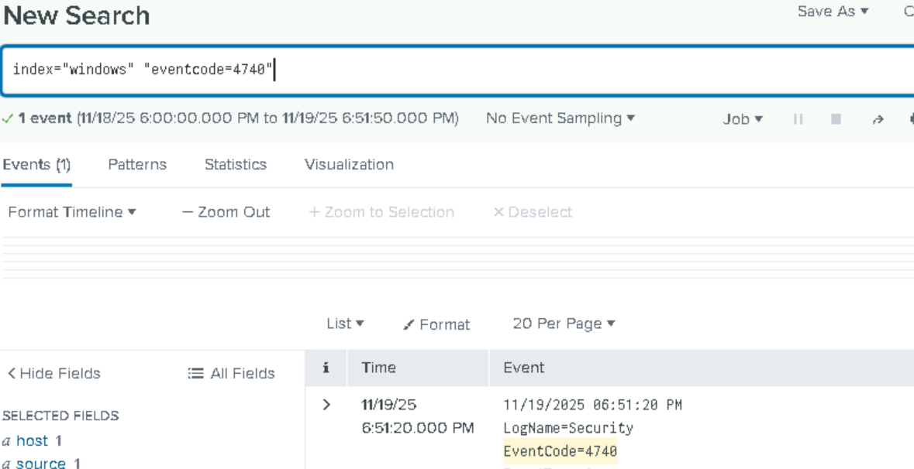

# Splunk Log Analysis – Failed Logons & Account Lockouts

## Objective

This project unit focuses on analyzing Windows Security logs ingested into Splunk to:

- Detect failed logon attempts (Event ID 4625)
- Detect account lockouts (Event ID 4740)
- Correlate failed logons and lockouts to understand brute-force attack patterns

This analysis is a critical SOC workflow for identifying authentication threats and validating preventive controls.

# Environment Overview
| Component                | Role                                               |
|--------------------------|---------------------------------------------------|
| DC01                     | Windows Domain Controller generating logon events|
| Universal Forwarder(DC01)| Sends Security logs from DC01 to Splunk           |
| Win11 (Splunk Enterprise)| SIEM analyzing forwarded logs                     |
| Index Used               | windows                                           |

# 1️⃣ Verify Log Ingestion

## Steps
1. Open Splunk Enterprise and navigate to **Search & Reporting**.
2. Run the following SPL query to check log ingestion:

`index=windows | head 20`

Verify that Security, System, and Application logs from DC01 are visible

---

# 2️⃣ Analyze Failed Logons (Event ID 4625)

## Steps

Run the following SPL query:

`index=windows EventCode=4625`

Investigate the following:
- Source IP address
- Target username
- Failure reason
- Frequency / burst patterns
- Logon type

## Purpose
- Detects brute-force attempts
- Identifies targeted accounts and attack patterns

3️⃣ Analyze Account Lockouts (Event ID 4740)
Steps


# 3️⃣ Analyze Account Lockouts (Event ID 4740)

## Steps
Run the following SPL query:

`index=windows EventCode=4740`

Investigate the following:
- Locked account name
- Source computer triggering lockout
- Timestamp of lockout
- Correlation with preceding failed logons

## Purpose
- Confirms preventive controls (account lockout) are effective
- Provides evidence of attack mitigation




4️⃣ Correlate Failed Logons & Lockouts
Steps

---

# 4️⃣ Correlate Failed Logons & Lockouts

## Steps
Run the following SPL query:

`index=windows (EventCode=4625 OR EventCode=4740) | sort _time`

- Observe the sequence of failed logons followed by lockouts.

## Purpose
- Visualizes attack timeline
- Supports SOC incident investigation
- Helps understand attack → detection → prevention workflow


---

# 5️⃣ Analyst Findings

- Failed logons from attacker IP targeting **TestAccount**
- Lockout confirms Windows account lockout policy by Active Directory
- Correlation shows complete attack → response sequence

---

# 6️⃣ Failed Attempts, Successful Breach: Red Alert! 🔥

## Importance
- A **successful logon Event ID: 4624 after multiple failed attempts** can indicate a **successful brute-force attack**.

Correlating failed and successful logons helps detect:
  - Compromised accounts
  - Gaps in preventive controls (e.g., missing account lockout policies)
  - Potential breaches before lateral movement occurs

## How to Correlate
1. Query both failed and successful logon events for the same account and source IP.
2. Sort events by `_time` to visualize the sequence.
3. Identify patterns where repeated failures are followed by a success.

```
index=windows (EventCode=4625 OR EventCode=4624)
| eval Status=case(EventCode==4625, "Failed", EventCode==4624, "Successful", true(), "Other")
| table _time, Account_Name, src_ip, Status, Workstation_Name, Message
| sort Account_Name, src_ip, _time
| streamstats current=f last(Status) as PrevStatus by Account_Name, src_ip
| where PrevStatus="Failed" AND Status="Successful"
| stats count(eval(Status=="Failed")) as FailedLogons, 
        count(eval(Status=="Successful")) as SuccessfulLogons
        by Account_Name, src_ip
| where FailedLogons >= 5
| sort -FailedLogons
```

## What This Query Does

- Filters for **failed (4625)** and **successful (4624)** logons.  
- Uses `case()` to label each event as **Failed**, **Successful**, or **Other**.  
- Shows key fields for investigation.  
- Sorts events chronologically by **Account_Name** and **src_ip**.  
- Uses `streamstats` to track the previous logon status.  
- Flags sequences where a **Failed logon** is immediately followed by a **Successful logon**.  
- Aggregates counts of failed and successful logons per account/IP.  
- Filters for accounts with **5 or more failed attempts before success** (adjustable).  
- Sorts results by the number of failed logons to prioritize investigations.  

## Next Steps
- Investigate the account for unauthorized access and reset credentials if necessary.
- Ensure **account lockout policy** is configured and enforced.
- Enable alerts in Splunk for suspicious patterns of repeated failed logons followed by success.
- Review associated systems for signs of lateral movement or further compromise.
- Consider implementing **multi-factor authentication (MFA)** for high-risk accounts.

---
