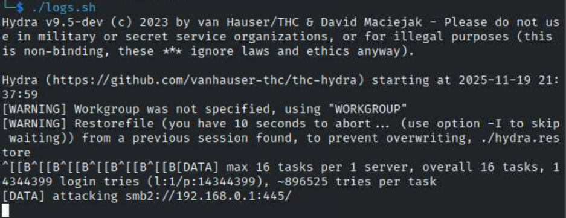
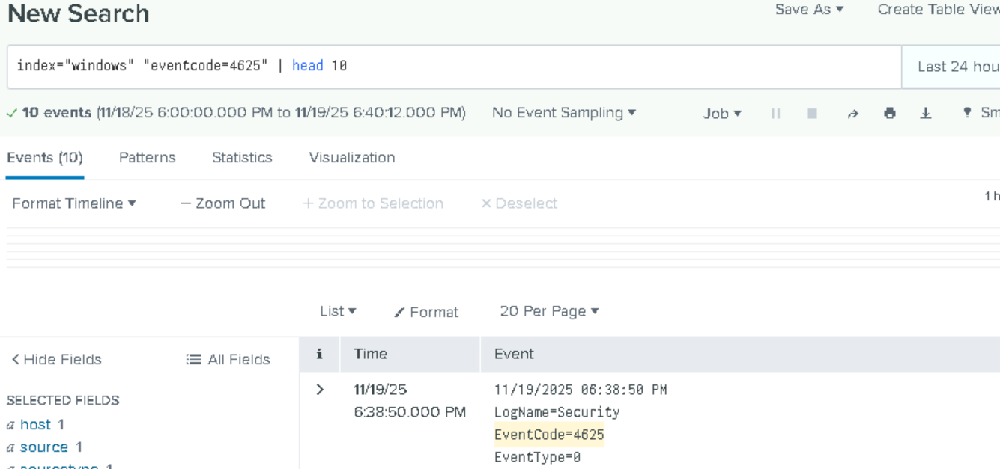

# Hydra Brute-Force Attack Simulation  

## Objective  

This project unit demonstrates how a brute-force authentication attack is performed using **Hydra** from a Kali Linux attacker machine against a Windows Domain Controller.  
The goal is to generate real-world failed logon activity (Event ID 4625) and potential account lockouts (Event ID 4740) for later detection, analysis, and correlation in SIEM tool.

---

# Environment Overview  

| Component | Role |
|----------|------|
| **Kali Linux** | Attacker machine running Hydra |
| **DC01** | Windows Domain Controller (authentication target) |
| **Win11 (Splunk Enterprise)** | Receives and indexes logs |
| **Index Used** | `windows`|

---

# 1️⃣ Hydra Installation & Preparation  

Hydra normally comes pre-installed on Kali Linux. If needed:

`sudo apt update`
`sudo apt install hydra -y`

Verify installation:

`hydra -h`

Wordlist used:

`/usr/share/wordlists/rockyou.txt`

If compressed:

`sudo gunzip /usr/share/wordlists/rockyou.txt.gz`

---

# 2️⃣ Attack Target Information

- Target: DC01
- Protocol: SMB
- Account: TestAccount
- Wordlist: rockyou.txt
- Outcome: Multiple failed logon attempts → Windows Event ID 4625

---

# 3️⃣ Executing the Hydra Brute-Force Attack

Hydra command used:

`hydra -l TestAccount -P /usr/share/wordlists/rockyou.txt smb://<DC01-IP>`

For convenience, save the hydra command to a shell script for reusability.

---

# 4️⃣ Expected Behavior & Log Generation

During the brute-force attack:

- Windows DC logs Event ID 4625 (Failed Logon)
- If lockout threshold is met → Event ID 4740 (Account Lockout)
- Universal Forwarder forwards logs to Splunk
- Events appear under index: windows

---

# 6️⃣ Why This Simulation Matters

This attack unit:

- Produces authentic brute-force log data
- Validates SIEM logging pipeline
- Prepares evidence for dashboards and alerts
- Confirms Windows lockout policy works as intended

This forms the foundation for your next units:
Splunk log correlation, brute-force detection rule creation, and dashboards.

---

# Conclusion

The Hydra brute-force attack successfully generated real authentication failure and lockout events that were ingested into Splunk for monitoring and detection.

This technique can also be used on other services:

- SSH brute-force
- FTP brute-force
- RDP password attacks
- Web login brute-force
- API authentication testing

---

