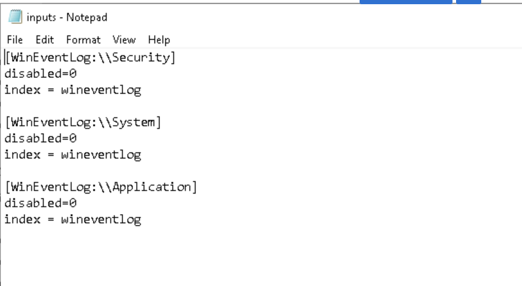
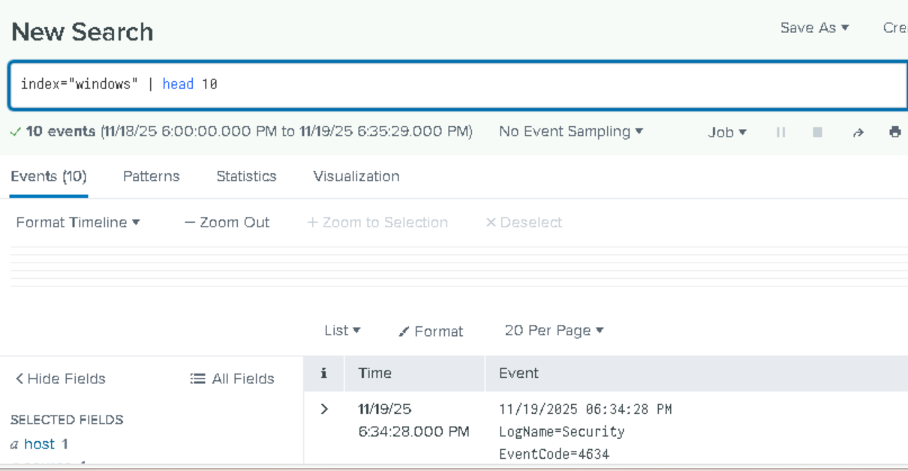

# Index Creation, Universal Forwarder Inputs File, Alerts and Dashboard Configuration

---

##  Objective  
This project unit focuses on essential components of Splunk ingestion setup:

1. Creating a custom index in Splunk Enterprise (server side)  
2. Configuring the Splunk Universal Forwarder (client side) to send logs into that specific index 
3. Configuring Alerts and Dashboard using SPL queries

This is the foundation for structured log ingestion and enables all detection and analysis tasks later and below involves sample of windows event log ingestion.

---

##  Environment Overview  

| Component | Role |
|----------|------|
| **Win11** | Splunk Enterprise Server |
| **DC01** | Domain Controller — Windows Event Logs source |
| **Universal Forwarder** | Installed on DC01 |
| **Index Used** | `windows` |

---

# 1️⃣ Creating a Custom Index in Splunk Enterprise  

**Navigation:**  
`Splunk Web → Settings → Indexes → New Index`

### Steps  
1. Click **New Index**  


2. Configure the following:  
   - **Index Name:** `windows`  
   - **Data Type:** Events  
   - Leave other settings as default  

3. Save the index and verify its creation by searching it in Search Index field.


---

# 2️⃣ Configuring Universal Forwarder to Send Logs to the Index  

Universal Forwarder config files are stored in:

`C:\Program Files\SplunkUniversalForwarder\etc\system\local\`


Edit the file: `inputs.conf` to include the necessary Windows logs. Here we mention Security, System and Application Event logs.



### Explanation  

| Setting                  | Purpose                                                   |
|--------------------------|-----------------------------------------------------------|
| `disabled = 0`           | Enables the log source                                    |
| `index = windows`        | Sends logs to your custom index                           |
| `WinEventLog://Security` | Forwards Windows Security Logs (4624, 4625, 4740, etc.)   |

---

## 🔄 Restart the Universal Forwarder  

After editing `inputs.conf`, restart the service in the cmd.exe window to apply changes:

`cd C:\Program Files\SplunkUniversalForwarder\bin`

Use splunk CLI to restart the splunk universal forwarder

`splunk restart`

---

# 3️⃣ Validate Log Ingestion in Splunk  

Run the following SPL query to check if logs are flowing:

`index=windows | head 20`



You should see Security, System, and Application event logs from DC01.

---

# 4️⃣ Alert Configuration

Following the log ingestion and indexing, spl queries can be saved as **alerts** to trigger emails, incident ticket creation and webhooks pointing SOAR playbook (e.g. block IP) based on its severity.

Below is an example of Alert creation to Brute force attempts.

1. Run the SPL query in Search & Reporting.
```index=windows EventCode=4625
| stats count by src_ip, user, host
| where count > 10
| sort - count
```

2. Click Save As → Alert.

3. Configure the following and do a test run to verify successful alert creation.

| Setting             | Value                               |
|---------------------|--------------------------------------|
| Alert Type          | Scheduled                            |
| Run Every           | 5 minutes                            |
| Trigger Condition   | Number of results > 0                |
| Trigger Actions     | Email / Notable Event / Webhook      |
| Severity            | High                                 |

---

# 5️⃣ Dashboard Configuration

Dashboards provide visual insights into security and audit activities, helping identify suspicious patterns.

Below is the workflow for dashboard creation

1. Create a Dashboard → Define name, permissions, and layout.
2. Add Panels → Each panel represents a metric, chart, or table.
3. Assign SPL Query to Panel → The search that generates the data.
4. Set Visualization Type → Table, chart, single value, heatmap, etc.
5. Save Dashboard → View real-time or historical results.

# 6️⃣ Saved Searches

A **Saved Search** is a Splunk search (SPL query) that is stored centrally for reuse.  
It can be used in:

- Dashboards (as panels)
- Alerts
- Reports
- Scheduled jobs

This helps to avoid duplication, maintain consistency, and simplify management of queries.

---

#  Conclusion 
  
The same methodology used here can be applied to a wide range of systems, including:

- Linux servers  
- Sysmon (advanced Windows telemetry)  
- Firewalls and IDS/IPS devices  
- Cloud applications  
- Any application capable of generating logs  

Following this standardized workflow ensures:

- Consistent log organization  
- Easier troubleshooting and maintenance  
- Better visibility and control over data sources  
- Faster development of detections, dashboards, and use-cases  
- A more manageable and scalable security monitoring environment  

---
